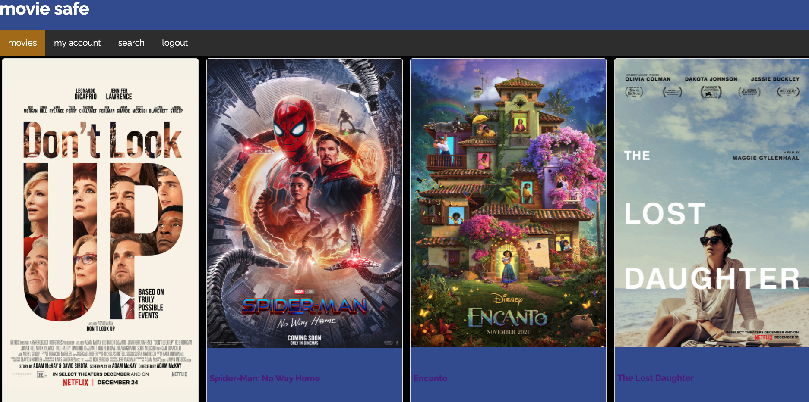

# movie safe

Reviews for parents and kids. Check and see if the movie is safe to watch.

## React Front end for movie safe application

## Built with:

- React, Redux, Thunk, JavaScript, CSS, Ruby on Rails.

## Deployment - Dependencies

## back end

Grab the back end repo and clone it down to your machine.

[movie safe api](https://github.com/danainjax/movie-safe-api)

You will need an API key for IMDB-API. 
https://imdb-api.com/Identity/Account/Register 

After you have your key, create a `.env` file in the root directory of the back end on your machine. 

Create an environment variable and set it equal to the key you received from the IMDB-API site.  
`REACT_APP_IMDB_API_KEY="api key"` 

`rails db:create` 

`rails db:seed` 

`rails s`  

## for the front end

Clone the front end code down to your machine.

`npm install` 

`npm start` 

## Contributing

Pull requests are welcome. For major changes, please open an issue first to discuss what you would like to change.

Author:

_Dana Pughakoff_

License:
Open Source through MIT License (See LICENSE file)

Acknowledgements:
https://www.commonsensemedia.org/ for inspiration

This project was bootstrapped with [Create React App](https://github.com/facebook/create-react-app).
